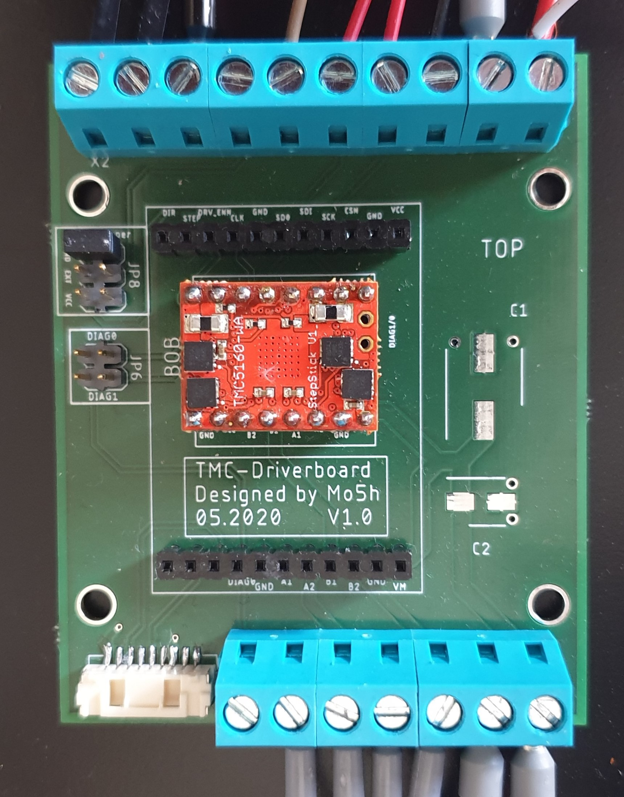

# TMC-Stepstick-BOB-External-Driver-Board

A external driver board for the TMC (Trinamic) stepstick or bob driver. Features:

   - Pin header or socket
   - Screw terminals
   - Clk and diag selections
   - Place for capacitors
   - Encoder plug (TMC5160)

Picture of the "old" version

